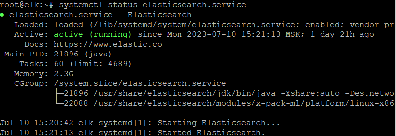
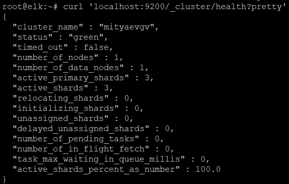

# 11-03_elk
HW_11-3_ELK

# Домашнее задание к занятию 3 «ELK»

### Задание 1. Elasticsearch
Установите и запустите Elasticsearch, после чего поменяйте параметр cluster_name на случайный.

Приведите скриншот команды 'curl -X GET 'localhost:9200/_cluster/health?pretty', сделанной на
сервере с установленным Elasticsearch. Где будет виден нестандартный cluster_name.

Установка **Elasticsearch**:

```
apt update && apt install gnupg apt-transport-https
wget -qO - https://artifacts.elastic.co/GPG-KEY-elasticsearch | sudo apt-key add
echo "deb [trusted=yes] https://mirror.yandex.ru/mirrors/elastic/7/ stable main" | sudo tee /etc/apt/sources.list.d/elastic-7.x.list
apt update && apt install elasticsearch
systemctl daemon-reload
systemctl enable elasticsearch.service
systemctl start elasticsearch.service
```
Проверка состояния работы сервиса:
```
systemctl status elasticsearch.service
```
<kbd></kbd>

Изменим **cluster_name** в **/etc/elasticsearch/elasticsearch.yml** на **mityaevgv**:

<kbd></kbd>

Перезапустим сервис **elasticsearch.service**:
```
systemctl restart elasticsearch
```
Проверка параметров сервера:
```
curl -X GET 'localhost:9200/_cluster/health?pretty
```
<kbd></kbd>


